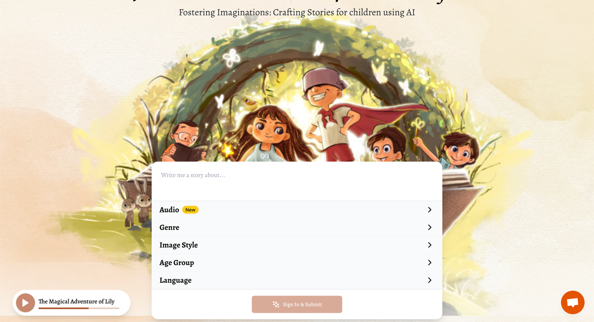
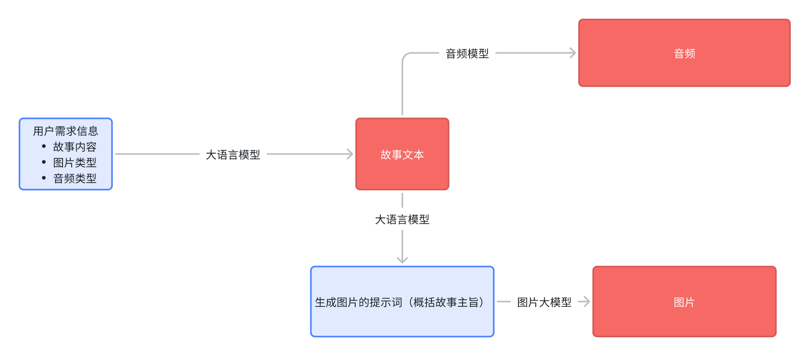

# 简介
为孩子们制作魔法故事
每个孩子都应该有一个故事来点燃他们的好奇心，点燃他们的梦想，带他们踏上一段奇妙的旅程。有了Flutter Dreams，为您的孩子创造激动人心的故事从未如此简单！为了每一位家长，为了每一位教育者
找一个完美的睡前故事！或者是一个故事来点亮你的教室！
该项目是一个基于大语言模型的儿童故事生成器，用户可自由指定内容，如故事主旨、音频角色、故事类型、图片类型、儿童年龄段等，生成一个简短的故事及音频供用户使用，不限于娱乐，教育。
# webUI

## 1. 主页面（一个表单）
- 故事关于内容（用户主观输入）
- 音频角色选择（有道角色列表）
- 故事类型
- 图片类型
- 儿童年龄段
## 2. 结果页面
- 图片
- 文本
- 音频
# 服务端
  github：https://github.com/yilake857/ai-story-generation/
  ## route
### 1. /health
   心跳请求，看看服务器挂没有？
### 2. /getAudio
   请求音频资源，因为请求的TTS模型没有暂挂url的能力
### 3. /story
   返回 图片url，文本，音频

1. 大语言服务（豆包）
2. TTS（网易有道）
3. 图片生成服务（阿里通义万相）

## 后续优化：
能不能介入openAI的模型，效果远优于豆包等。。。
# 前端展示
TODO

# 环境
go1.23
python3.13