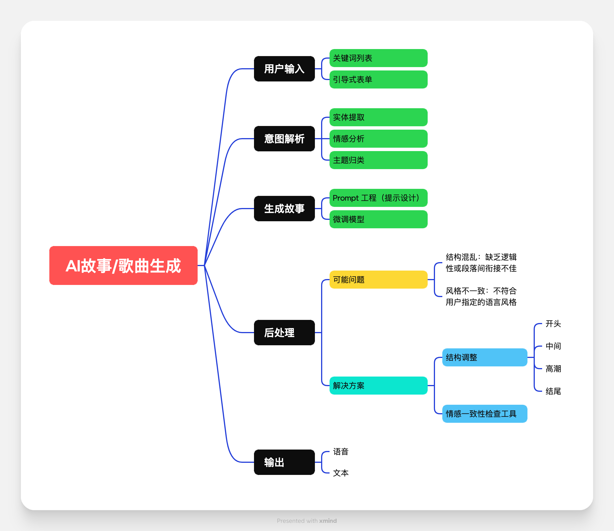

# Flutter Dreams

## 基本效果：用户给定几个词或与之相关性的话生成一个故事或者歌曲

## 添加效果：
- 输入
    - 文本(关于故事方面...Write me a story about...)
    - 选择项
        - 音频角色(audio)
        - 故事类型
        - 图片风格
        - 儿童年龄段
- 输出
    - 图片
    - 音频
    - 文字 

## 定位：
1. 故事 儿童 输入几个词作为睡前故事或者学习资料,应用于睡前故事或者课堂小故事，可结合一个学习机终端
2. 生成歌曲播放 --通用大模型无法实现,可以找找调用api的模型实现 

框架结构:

# 注意的问题
- 免费
- 国内访问限制

# 通用大模型
- chatgpt
- 豆包

# TTS
- 网易有道https://ai.youdao.com/product-tts.s

# image AIGC
- 可话https://www.canva.com/ja_jp/ai-image-generator/
- https://www.fotor.com/cn/pricing/

# music AIGC
- https://suno.com/ api:https://github.com/gcui-art/suno-api 
- 

参考：
- [https://easy-peasy.ai/zh/templates/ai-story-generator]()

- 做儿童向的aigc:https://storybee.app/

难点：
- 各类api的糅合
- 通用模型的提示词需要尽量完善

# api调用探究
- 豆包 大语言模型
